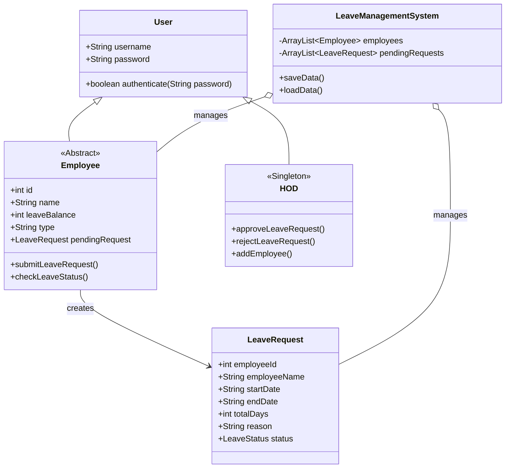

# Leave Management System

A robust, console-based Java application for managing employee leave requests. This system features a dual-role login (Employee & HOD) and persistent data storage using Java Serialization.

## 🚀 Features

### for Employees
*   **Secure Login**: Authenticate using Employee ID and Password.
*   **Leave Balance**: View current leave entitlement.
*   **Submit Request**: Apply for leave with auto-calculation of days (based on date range).
*   **Status Tracking**: Check the status of submitted leave requests (Pending, Approved, Rejected).

### for HOD (Head of Department)
*   **Admin Dashboard**: View all pending leave requests.
*   **Approval Workflow**: Approve or Reject leave requests.
*   **Employee Management**: 
    *   View all registered employees.
    *   Add new employees (Full-Time or Contract).
    *   Delete employees.
*   **Review System**: Access detailed leave history and reasons.

## 🛠 Tech Stack

*   **Language**: Java (JDK 8+)
*   **User Interface**: Console/Terminal-based UI
*   **Persistence**: Java Serialization (Custom `.dat` file storage)
*   **Build Tool**: None (Standard Java Compiler)
*   **Dependencies**: Java Standard Library (`java.util`, `java.io`) - No external JARs required.

## 📂 Project Structure

The project is structured around the `LeaveManagementSystem` package:

*   **`Main.java`**: The entry point of the application. Handles the main menu and login flow.
*   **`LeaveManagementSystem.java`**: The core controller class. Manages lists of employees and requests, and handles data persistence.
*   **`Employee.java` (Abstract)**: Base class for `FullTimeEmployee` and `ContractEmployee`.
*   **`LeaveRequest.java`**: Data model representing a single leave application.
*   **`HOD.java`**: Singleton class representing the Head of Department.

## 💾 Database & Schema

This project uses a **File-Based Database** system. Data is serialized into binary files for persistence.

*   `employees.dat`: Stores the list of Employee objects.
*   `leave_requests.dat`: Stores the list of pending LeaveRequest objects.

### Class Diagram (Schema Visualization)



## ⚙️ Setup & Run Instructions

### Prerequisites
*   Java Development Kit (JDK) installed (version 8 or higher).

### How to Run
1.  **Compile the Project**:
    Navigate to the parent directory of the `LeaveManagementSystem` package and run:
    ```bash
    javac LeaveManagementSystem/*.java
    ```

2.  **Start the Application**:
    Run the compiled main class:
    ```bash
    java LeaveManagementSystem.Main
    ```

### Login Credentials (Default)
*   **HOD (Admin)**: 
    *   Username: `admin` (or configured default)
    *   Password: `admin` (or configured default)
*   **Employees**: 
    *   Login with the Employee ID and Password created by the HOD.
